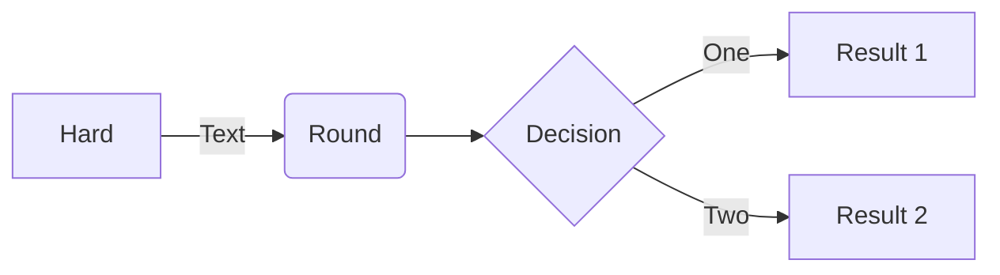

### 登入
```json
{
  "username":"101",
  "password":"abcd1234"
}
```
```sql
SELECT UserPwd, UserName FROM UserBase WHERE UserNo = @username
```

### 最新公告
```json
```
```sql
```

### 共識卷
```json
```
```sql
```

### 範例卷
```json
```
```sql
```

### 訓練卷
```json
```
```sql
```

### 批閱卷
```json
```
```sql
```





